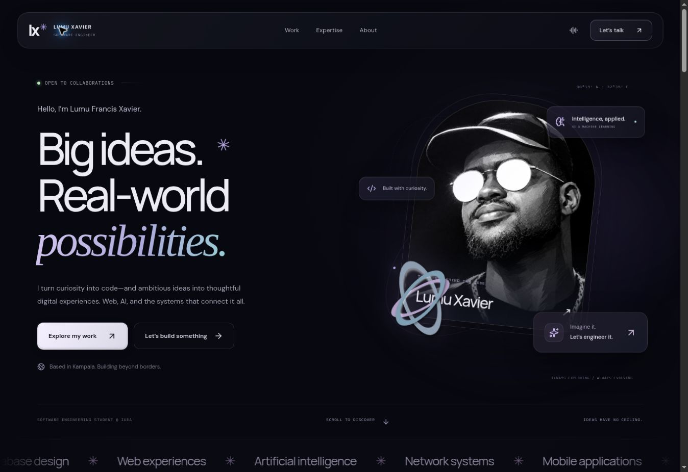

# Lumu Francis Xavier — Portfolio

A glass-and-motion React portfolio for Lumu Francis Xavier, a software engineering student in Kampala, Uganda. The design brings together a floating portrait, a reflective 3D sculpture, layered glass cards, interactive capability stories, and responsive layouts.

The site intentionally presents **capability rather than named project case studies**. Private client work, unfinished products, and confidential project details are not published. The copy describes experience across web applications, systems, AI/ML, networking, databases, and an ongoing exploration of mobile applications.



## Local development

Use Node.js 22.12 or later. Deployment uses Node.js 24.

```sh
npm ci
npm run dev
```

## Production build

```sh
npm run build
```

The `dist/` folder contains the complete static website generated by Vite and the prerender step. It is committed for manual upload if needed. All fonts, icons, scripts, and portrait assets are local. The homepage includes its content before JavaScript runs.

The Three.js sculpture loads separately from the main application. Rendering pauses when it is outside the viewport or the tab is hidden, and pixel density is capped to limit GPU work. Browsers without WebGL use an animated CSS sculpture. The motion control remembers the visitor's choice and the page respects the system's reduced-motion preference.

## InfinityFree deployment

The `Deploy to InfinityFree` GitHub Actions workflow runs on every push to `main`:

1. Install dependencies.
2. Run the production build.
3. Verify the required FTP secrets.
4. Upload the generated `dist/` contents to the configured InfinityFree `htdocs` directory.

Required repository Actions secrets:

| Secret | Value |
| --- | --- |
| `FTP_SERVER` | Hosting account's FTP hostname |
| `FTP_USERNAME` | Hosting account's FTP username |
| `FTP_PASSWORD` | Hosting account's FTP password |
| `FTP_SERVER_DIR` | Verified website directory ending in `/htdocs/` |

Target domain: [lumuxavier.site.je](https://lumuxavier.site.je).

The workflow builds from source and uses certificate-verified FTPS. Missing secrets cause the upload step to be skipped; a successful build alone does not confirm deployment. Credentials belong in GitHub Actions secrets, never in source files.

For manual deployment, upload the **contents** of `dist/` into the domain's `htdocs` directory, preserving its subfolders. There is no Node.js server to run on InfinityFree.

## Content and privacy

Edit `src/profile.js` for public contact information, capability descriptions, and technology lists. Capability artwork is illustrative, not a screenshot or disclosure of a private product. No individual project repository or demo links are included. The portrait is the supplied original image; the lower-resolution legacy portrait remains available at its existing path.

Public contact links:

- GitHub: [lumuxav](https://github.com/lumuxav)
- WhatsApp: [0757 742 177](https://wa.me/256757742177)
- Instagram: [_l.u.m.u_](https://www.instagram.com/_l.u.m.u_/)

The contact form validates the visitor's name and message, then opens a WhatsApp draft. The visitor chooses whether to send. There is no form submission server or stored message database. The study year, student identifier, private project details, and unsupported credentials are omitted.

## Verification

The production build includes server rendering and asset generation. Browser checks cover desktop and narrow phone layouts, navigation, capability filters, native dialog opening and Escape dismissal, motion controls, and contact validation. The deployed site was verified on 2026-09-28 UTC: the homepage loaded over HTTPS, the motion control responded, capability filtering and dialog opening/Escape dismissal worked, and the public contact destinations matched the configured links. The available browser has WebGL disabled, so the animated fallback is visually checked; the WebGL sculpture requires a browser with GPU support for visual verification.

## Structure

```text
src/App.jsx             Sections, interactions, dialogs, and contact composer
src/profile.js          Public profile, build domains, skills, and links
src/createOrbitScene.js  Lazy-loaded Three.js sculpture and lifecycle
src/styles.css          Glass theme, animation, and responsive layout
src/main.jsx            React hydration and locally bundled fonts
src/render.jsx          Server render used during the build
scripts/prerender.mjs    Build-time HTML generation
.github/workflows/      Automatic InfinityFree deployment
public/                 Static assets and licenses
dist/                   Generated files ready for htdocs
```

Font and Three.js licenses are included under `public/licenses/` and copied into the upload folder. Lucide icons are provided under the ISC license.
